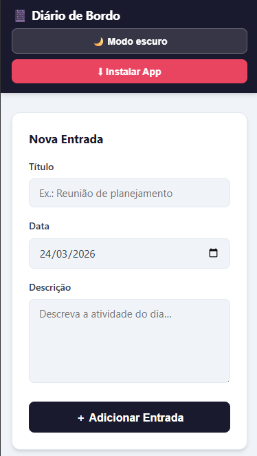

# Diario de Bordo PWA

<p align="center">
   Projeto desenvolvido como <b>Exercicio do Modulo 31</b> do curso da <b>EBAC</b>,
   com foco em <b>Aplicativos Web Progressivos (PWAs)</b>.
</p>

<p align="center">
   <a href="https://ricardo-dev-00.github.io/Diario-de-Bordo_PWA/">
      
   </a>
   
   
   
</p>

---

## Deploy

Acesse a versao publicada:

### https://ricardo-dev-00.github.io/Diario-de-Bordo_PWA/

## Preview

<p align="center">
   
</p>

## Sobre o projeto

O Diario de Bordo e uma aplicacao web com experiencia de app, criada para registrar atividades diarias de forma simples, rapida e com suporte offline.

Este projeto foi produzido como atividade pratica da EBAC para consolidar os principais conceitos de PWA:

- manifest para instalacao
- service worker com cache
- comportamento mobile-first
- experiencia semelhante a aplicativo nativo

## Objetivos do exercicio (Modulo 31 - EBAC)

- Aplicar conceitos reais de Progressive Web App.
- Configurar manifest com metadados de instalacao.
- Implementar service worker e estrategia de cache.
- Garantir funcionamento offline e boa experiencia mobile.
- Publicar a aplicacao no GitHub Pages.

## Funcionalidades

- Criacao de entradas no diario.
- Edicao de entradas existentes.
- Remocao com modal de confirmacao customizado.
- Ordenacao por proximidade de data.
- Badges de contexto temporal (Hoje, Amanha, Ontem, etc.).
- Paginacao de registros (ver mais / ver menos).
- Tema claro/escuro com persistencia local.
- Fluxo de instalacao PWA com dialogo customizado.
- Mensagens de status com auto-hide.
- Uso offline com cache de assets essenciais.

## Stack e tecnologias

- HTML5
- CSS3 (custom properties, grid/flex, media queries)
- JavaScript Vanilla (ES6+)
- Web App Manifest
- Service Worker + Cache API
- LocalStorage
- GitHub Pages (deploy)

## Arquitetura PWA implementada

- display: standalone
- orientation: portrait-primary
- start_url e scope configurados
- icones 192x192 e 512x512 (any/maskable)
- screenshots no manifest para preview de instalacao
- beforeinstallprompt com fluxo de instalacao guiado
- cache-first para arquivos estaticos
- fallback offline para index.html

## Estrutura do projeto

```text
modulo-31/
|- icons/
|- index.html
|- style.css
|- script.js
|- manifest.json
|- service-worker.js
|- README.md
```

## Como executar localmente

1. Clone o repositorio.
2. Abra a pasta no VS Code.
3. Rode com servidor local (Live Server, por exemplo).
4. Abra no navegador e valide:
    - CRUD de entradas
    - tema claro/escuro
    - instalacao como app
    - funcionamento offline

## Qualidade e boas praticas adotadas

- Layout mobile-first e responsivo
- Estados de interface claros (empty, editando, instalacao)
- Separacao de responsabilidades (HTML, CSS e JS)
- Sem dependencias externas para logica core
- Acessibilidade basica com aria-label, aria-live e role dialog/alertdialog
- Sanitizacao do conteudo renderizado
- Ajustes para experiencia touch em mobile

## Autor

Ricardo

---

Projeto academico para fins de estudo no curso da EBAC.
